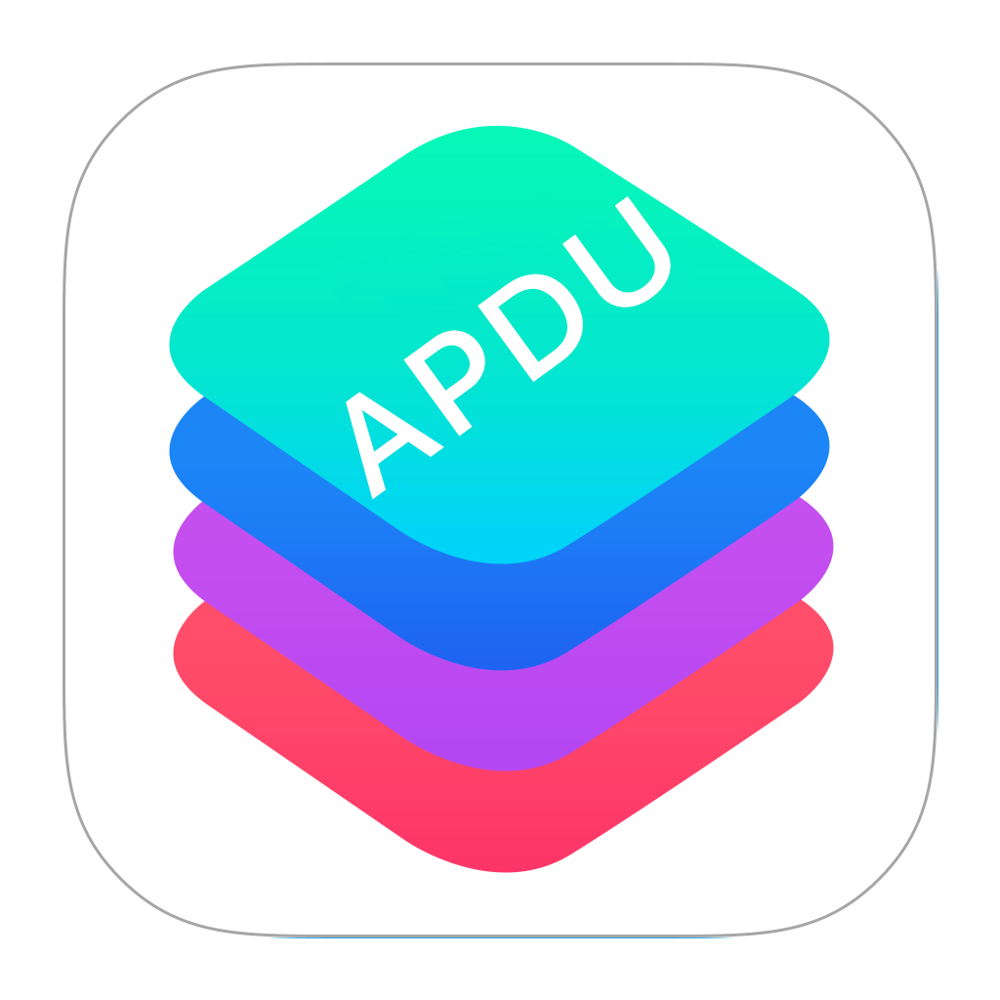

# Application Protocol Data Unit Kit
[](https://git.ul-ts.com/sl-advisory/RDW/apdukit-swift/commits/develop)

This aims to help developers build, parse and interpret APDU. An application protocol data unit (APDU) is commonly used in the context of smart cards and is the communication unit between a smart card reader and a smart card. The structure of the APDU is defined by ISO/IEC 7816-4 which this project tries and partly encapsulate and simplify.

This can be used in the context of mobile devices or smart cards.

!! Please note that this project is still under heavy development and not ready for use in production.

## Mobile Driving License Interoperability Learning Platform

This project is apart of the mobile Driving License Interoperability Learning Platform. Please see the [main repository](https://github.com/mDL-ILP/mDL-ILP) for more information.

## Installation
1. Install Cocoapods.
2. Follow the instructions below:

## Cocoapods
Add the following to your Podfile.
```
    pod 'apduKit', :git => 'https://github.com/mDL-ILP/apdukit-swift.git', :branch => 'master', :tag => 'x.x.x'
```

3. import apduKit in your Swift file and checkout examples to see how to use it.

## Development
1. Run: pod install
2. Open the apduKit.xcworkspace
3. Run the tests.

## How to use it?
TODO: We're still working on this. For now please see the unit tests. Especially the integration tests on the interpreter layer.